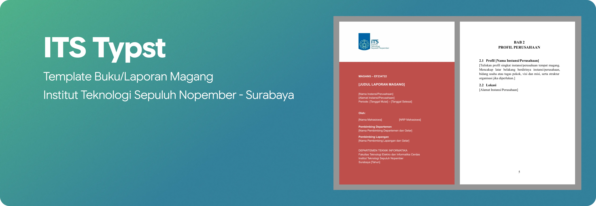

<div align="center">
  <h1>Template Laporan Magang — Typst</h1>

  <p>
    
    
    
    
  </p>

  <p>Template <a href="https://typst.app">Typst</a> untuk Laporan Magang (EF234722, 6 sks) Departemen Teknik Informatika ITS. Format mengikuti berkas resmi <code>reference/Template-Magang-Fixed.docx</code>: kertas <strong>A5 (148 × 210 mm)</strong>, margin atas/bawah/kiri 2,5 cm dan kanan 2 cm, huruf Times New Roman 12 pt.</p>
</div>

## Yang perlu dipasang

| Alat | Keterangan |
|---|---|
| [Typst](https://github.com/typst/typst) 0.13+ | mesin penyusun dokumen (`typst --version` untuk cek) |
| Font Times New Roman & Arial | biasanya sudah ada di Windows |
| VS Code + ekstensi **Tinymist** | opsional, untuk pratinjau langsung |

## Cara pakai singkat

1. Buka `data.yaml`, ganti semua teks dalam kurung siku `[...]` dengan data asli.
2. Tulis isi laporan di `content/chapters/01-bab1.typ` sampai `07-bab7.typ`.
3. Jalankan:

   ```bash
   typst compile main.typ      # sekali jadi main.pdf
   typst watch main.typ        # otomatis tiap kali file disimpan
   ```

4. Buka `main.pdf`.

## Isi folder

```
main.typ             perakit dokumen (AUTO — tidak usah diubah)
data.yaml            semua identitas: nama, NRP, pembimbing, instansi, periode
daftar-pustaka.bib   sumber sitasi
content/             halaman-halaman laporan
  00-cover.typ               sampul merah
  01-halaman-judul.typ       halaman judul putih
  02-daftar-isi.typ          4 daftar ini terisi
  03-daftar-gambar.typ       otomatis — tidak
  04-daftar-tabel.typ        perlu diketik
  05-daftar-kode-sumber.typ  manual
  06-lembar-pengesahan.typ   tanda tangan 2 pembimbing
  07-abstrak.typ             WAJIB EDIT
  08-kata-pengantar.typ      WAJIB EDIT
  09-daftar-pustaka.typ      otomatis dari daftar-pustaka.bib
  10-biodata-penulis.typ     WAJIB EDIT
  chapters/01-bab1.typ … 07-bab7.typ   isi bab
template/            aturan tampilan & fungsi bantu (AUTO — jangan diubah)
assets/brand/        logo ITS
assets/figures/      tempat menaruh gambar milik penulis
reference/           berkas docx resmi sebagai acuan
```

Tiap berkas diberi tanda di baris paling atas:

- **AUTO** → jangan diubah, sudah diatur otomatis.
- **WAJIB EDIT** → memang harus diisi penulis.

## Fungsi bantu

Menyisipkan gambar (otomatis masuk DAFTAR GAMBAR):

```typst
#gambar("../assets/figures/arsitektur.png", caption: [Arsitektur sistem])
```

Alamat berkas gambar dihitung dari folder `template/`, jadi selalu diawali
`../assets/...` walaupun ditulis di dalam `content/chapters/`.

Menyisipkan kode program (otomatis masuk DAFTAR KODE SUMBER):

```typst
#kode-sumber(caption: [Fungsi utama], ```js
function main() {}
```)
```

Menyisipkan tabel (otomatis masuk DAFTAR TABEL):

```typst
#figure(
  caption: [Spesifikasi perangkat],
  table(columns: 2, [*Nama*], [*Nilai*], [RAM], [8 GB]),
)
```

Menyitasi pustaka: tulis `@contoh-buku` di dalam kalimat, kuncinya diambil dari
`daftar-pustaka.bib`.

## Urutan halaman

Sampul → Halaman Judul → Daftar Isi → Daftar Gambar → Daftar Tabel →
Daftar Kode Sumber → Lembar Pengesahan → Abstrak → Kata Pengantar →
Bab I–VII → Daftar Pustaka → Biodata Penulis.

Nomor halaman: angka romawi (i, ii, iii …) untuk bagian awal, angka biasa
(1, 2, 3 …) mulai Bab I. Antarbagian disisipkan halaman
"Halaman ini sengaja dikosongkan" sesuai berkas resmi.

## Menambah atau mengurangi bab

Buat berkas baru di `content/chapters/`, lalu daftarkan di `main.typ`:

```typst
#include "content/chapters/08-bab8.typ"
```

Nomor bab, nomor gambar, nomor tabel, dan daftar isi ikut menyesuaikan sendiri.

## Kontributor

[](https://github.com/ITS-Typst/template-buku-Magang/graphs/contributors)

## Lisensi

Dirilis di bawah lisensi **MIT** — lihat [LICENSE](LICENSE) untuk teks lengkapnya. Bebas digunakan, dikembangkan, dan disesuaikan dengan kebutuhan.
